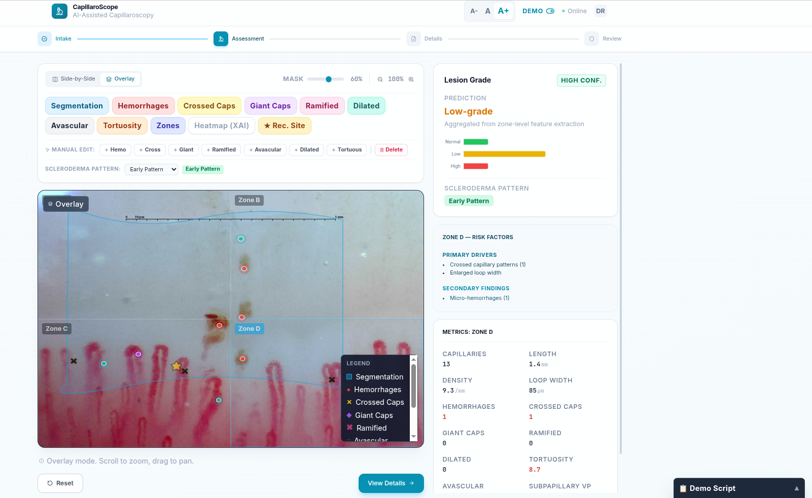

# CapillaroScope — AI-Assisted Capillaroscopy Dashboard



**CapillaroScope** is a production-grade, premium clinical decision-support application built for **Nailfold Video Capillaroscopy (NVC)** analysis. It leverages an advanced, professional "Soft UI Evolution" and "Glassmorphism" design system (guided by the *ui-ux-pro-max* principles) to deliver an interface that meets the highest standards of modern healthcare and AI diagnostic platforms.

This application provides real-time segmentation simulation, multi-layer visualization, and explainable AI overlays to assist clinicians in evaluating microvascular abnormalities.

##  Key Features

- **Premium Healthcare UI/UX**: Completely redesigned with a highly legible `Inter` typography scale, custom medical color palettes (`cyan-600` primary, `emerald-500` positive), and soft `backdrop-blur` glassmorphism card layouts.
- **Dynamic Accessibility Scaling**: Built-in, root-level font size controls (A-, A, A+) allowing users to instantly scale all text and UI elements proportionally without breaking layout constraints.
- **4-Step Clinical Workflow**: Seamlessly guides the user through Patient Intake → AI Assessment → Detailed Zone Metrics → Clinician Review & Final Sign-off.
- **Multi-Layer Image Viewer**: An interactive medical viewer allowing clinicians to toggle independent AI overlay layers including Capillary Segmentation, Hemorrhages, Crossed patterns, Zone boundaries, Heatmaps, and Recommended evaluation sites.
- **Side-by-Side Comparison**: Enables direct visual comparison between the raw capillaroscopy image and the AI-analyzed output.
- **Explainable AI (XAI) Panel**: Generates deterministic, consistent pseudo-predictions detailing primary abnormality drivers (e.g., giant capillaries, reduced density) and secondary findings, broken down by spatial zones (A–D).
- **Custom Image Integration**: Supports loading specific clinical images directly for review within the simulated AI pipeline.

##  Quick Start

Ensure you have Node.js installed, then run the following commands to start the application:

```bash
# Install dependencies
npm install

# Start the Vite development server
npm run dev
```

The application will be available at `http://localhost:3000` (or `3001` depending on port availability).

## 🏗 Architecture

```
capillorescop-app/
├── public/                 # Static assets and custom demo images (cap1.jpg, cap2.jpg)
├── src/
│   ├── main.tsx            # React entry point
│   ├── index.css           # Global Tailwind utilities and font imports
│   ├── App.tsx             # Main application shell, state orchestration, layout
│   ├── types.ts            # TypeScript interfaces and shared schemas
│   ├── constants.ts        # Data simulation, seeded PRNG, and demo image config
│   └── components/
│       ├── Button.tsx       # Standardized, accessible button component 
│       ├── ImageViewer.tsx  # Complex multi-layer interactive medical image viewer
│       └── ResultsPanel.tsx # AI prediction results, zone metrics, and probabilities
```

## 🛠 Tech Stack

- **Framework:** React 19 + TypeScript
- **Build Tool:** Vite 6
- **Styling:** Tailwind CSS + PostCSS (implementing *Soft UI Evolution* principles)
- **Data Visualization:** Recharts (probability charts)
- **Icons:** Lucide React
- **Typography:** Inter (Google Fonts)

---
*Disclaimer: This is a simulated clinical interface designed to demonstrate advanced UI/UX patterns and Explainable AI concepts. It is not intended for real medical diagnosis.*
